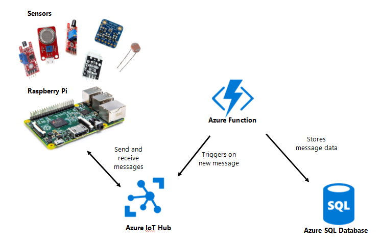
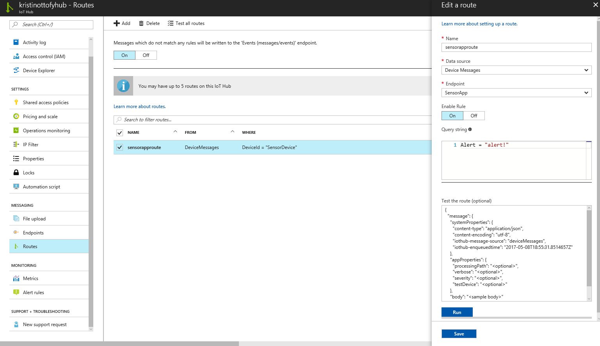

## **Update: See the newly added steps for IoT Hub Routing**

# Sensor App
Collects data from a variety of sensors using a Raspberry Pi running a Windows 10 IoT Core UWP app and stores it in an Azure SQL Database. 

## Hardware
- Raspberry Pi 2 Model B v1.1
- Keyes KY-036 Metal Touch Sensor
- Keyes K869051 Gas Sensor
- Keyes KY-026 Flame Sensor
- Keyes KY-031 Knock Sensor
- Adafruit BMP280 Barometric Pressure + Temperature Sensor
- Keyes KY-028 Light Sensor


## Technologies
- Windows 10 IoT Core
- Windows UWP App on Pi
- Azure Function
- Azure IoT Hub
- Azure SQL Server and Database

# Setup

## Azure Setup


1. Create an [Azure IoT Hub](https://docs.microsoft.com/en-us/azure/iot-hub/iot-hub-create-through-portal) and device. Copy the device connection string and save or copy for a later step.
2. Create a shared access policy or use one of the existing ones such as iothubowner. Compile the shared access policy and the endpoint url into a string like the following and save or copy for a later step.
    ```
    Endpoint=sb://iothub-ns-kristinott-86295-658bfe8745.servicebus.windows.net/;SharedAccessKeyName=sensorappkeyname;SharedAccessKey=superlongkey1234567901234567890=
    ```
3. Fork the repo [SensorAppAzureFunction](https://github.com/kottofy/SensorAppAzureFunction) 
and update the [function.json file](https://github.com/kottofy/SensorAppAzureFunction/blob/master/SensorReadingtoSQL/function.json) variable `path` with your IoT Hub Event Hub Compatible name.
4. Create an [Azure SQL Server and Database](https://docs.microsoft.com/en-us/azure/sql-database/sql-database-get-started-portal). In the Firewall settings, add your client IP. Copy or save the database ADO.NET connection string. Replace `Server=tcp:` with `data source=` and fill in the username and password so that the string goes from
    ```
    Server=tcp:senserapp.database.windows.net,1433;Initial Catalog=SensorDB;Persist Security Info=False;User ID={your_username};Password={your_password};MultipleActiveResultSets=False;Encrypt=True;TrustServerCertificate=False;Connection Timeout=30;
    ```
    to
     ```
    data source=senserapp.database.windows.net;initial catalog=SensorDB;persist security info=True;user id=username;password=p@ssw0rd;MultipleActiveResultSets=True;App=EntityFramework
    ```
5. Create an [Azure Function](https://docs.microsoft.com/en-us/azure/azure-functions/functions-continuous-deployment) from the source code from step 3. 
6. Go into the Application Settings and create the variable named `connectionstring` under App settings and paste the endpoint url from step 1 as the value. 
7. Create the variable `SensorReadingContext` under Connection strings and paste the value from step 4.


## Steps to run the Raspberry Pi App
1. Download the code in this repo and open in Visual Studio. 
2. In the AzureIoTHub.cs page, change the variable `deviceConnectionString` where it says `"***DEVICE CONNECTION STRING HERE***"` to the device connection string from the previous section step 1.
3. Change the run mode in Visual Studio to Remote Machine on ARM
4. Update the IP Address of the Remote Connection
    * Double click on Properties in the Solution Explorer and update the Debug section
5. Run the project on the Remote Machine
    * Nuget packages may need to be restored and project may need to be built or rebuilt and few times.

## Steps for IoT Hub Routing
1. Create a [Service Bus Event Hub](https://docs.microsoft.com/en-us/azure/event-hubs/event-hubs-create).
2. Update the Azure Function function.json file for the SensorReadingtoSQL file `path` variable with the value of the event hub name. Push to GitHub and the Azure Function should automatically pull the update.
3. In the Endpoints blade on the IoT Hub, create an Endpoint on the IoT Hub that has an endpoint type of Service Bus Queue and points to the queue created in step 1. Choose an appropriate name. See example below.
    
4. In the Routes blade for the IoT Hub, create a new routing rule with an appropriate name, data source as DeviceMessages, Query string `DeviceId = "SensorDevice"`, and Endpoint set to the endpoint created in step 3. See example below.
    